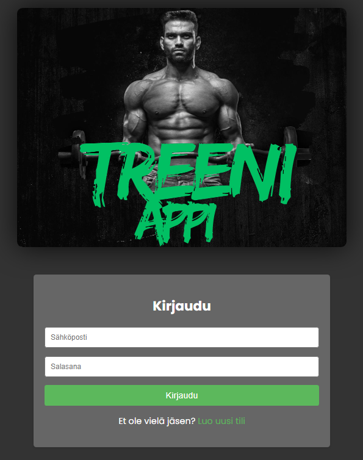
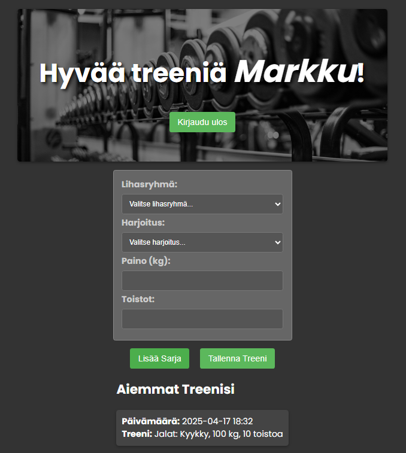

# Treeniappi-projekti
PHP-pohjainen treeniappi, jossa käyttäjät voivat kirjautua, rekisteröityä ja hallita omia harjoituksiaan.
## 📌 Huomio
Tämä projekti käyttää koulun sisäistä MariaDB-tietokantaa, eikä se ole tarkoitettu käytettäväksi koulun ulkopuolella.
Projektin koodi, rakenne ja logiikka ovat kuitenkin vapaasti nähtävissä ja arvioitavissa tästä GitHub-repositoriosta.
## 🔧 Kehittäjälle
Voit halutessasi testata projektia omalla palvelimellasi seuraavasti:
1. Luo oma tietokanta, esim. `treeniappi`
2. Luo tietokantaan tarvittavat taulut tuomalla mukana tuleva SQL-tiedosto esimerkiksi Adminerin, phpMyAdminin tai MySQL-komentorivin kautta:
   - `app/sql/database_structure.sql`
3. Kopioi `app/config/db_config.example.php` ja nimeä se `db_config.php`
4. Avaa `db_config.php` ja syötä siihen omat tietokantatunnuksesi
⚠️ Huom: Tietokantarakenne on mukana, mutta käyttäjädataa ei sisällytetä.
## 🧱 Tietokantarakenne
Tietokannan rakenne löytyy tiedostosta:  
`app/sql/database_structure.sql`
Tiedosto sisältää `users`- ja `workouts`-taulujen rakenteet ilman käyttäjädataa. Voit käyttää sitä oman testitietokannan luomiseen.
## 📁 Projektirakenne
- `app/` sisältää kaikki sovelluksen lähdekoodit ja rakenteet
- `app/config/db_config.php` on kehittäjäkohtainen tiedosto, jota ei tallenneta GitHubiin – se on suojattu `.gitignore`-tiedoston avulla
- `app/config/db_config.example.php` toimii mallina tietokantayhteyden määrittelyyn
- `app/sql/database_structure.sql` sisältää tietokannan rakenteen
- `images/` sisältää projektin kuvankaappaukset käyttöliittymästä
- Projektin juuressa on `README.md`, `.gitignore` ja kuvatiedostoja (esim. `treeniappi.jpg`)

## 📷 Kuvankaappaukset
Tässä muutamia kuvankaappauksia sovelluksen käyttöliittymästä:

### Kirjautumissivu

### Rekisteröitymissivu

### Harjoitusten hallintanäkymä

---
